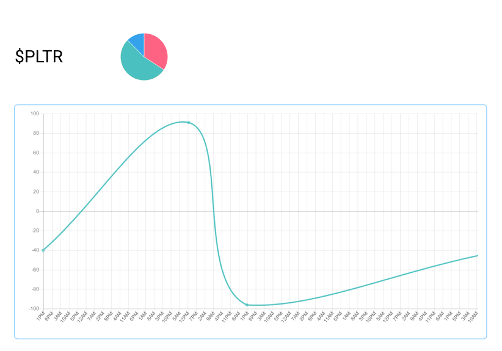

# stock-sentiment-analysis

This project is an attempt at performing a simple periodic sentiment analysis of given stock symbol on reddit.

## Requirements

- FastAPI

## Project architecture

A scheme of the whole project architecture can be found at on [figma](https://www.figma.com/file/hohoKkCm2DAsNAORkCqbGg/Untitled?node-id=0%3A1)

In short, the main process are:
- A script collect every 4 hours the newest posts
- Filter the fetched posts to keep the ones that have been created in the last 4 hours
- A FastAPI backend that use a sentiment analysis model to classify the fetched posts
- The FastAPI backend analyse the results and create stats that are then stored in a NoSQL DB
- A static web interface that fetch the data through the FastAPI DB 

## Data processing

### The reddit API

The reddit posts are fetched from the API with the format `http://www.reddit.com/r/{subreddit}/new.json?`

Other useful options that can be used in the queries are:
- `limit={limit_number}` (note that the upper limit is 100)
- `sort={sorting_option}`

## Additional ressources

In the building of the project, the following ressources are providing usefull informations:
- [arc.codes](https://arc.codes/) to build serverless application
- [Deploy a ML model with FastAPI](https://blockgeni.com/guide-to-fastapi-with-machine-learning-deployment/) guide
- [Deploy FastAPI as a Vercel serverless application](https://github.com/paul121/fastapi-zeit-now)
- [Sentiment analysis with python](https://medium.com/swlh/sentiment-analysis-using-python-and-nltk-library-d68caba27e1d)
- [Use FastAPI with MongoDB](https://medium.com/python-in-plain-english/how-to-use-fastapi-with-mongodb-75b43c8e541d)
- [Create A Reddit app](https://www.reddit.com/prefs/apps)
- [How to scrape reddit with python](https://www.storybench.org/how-to-scrape-reddit-with-python/)
